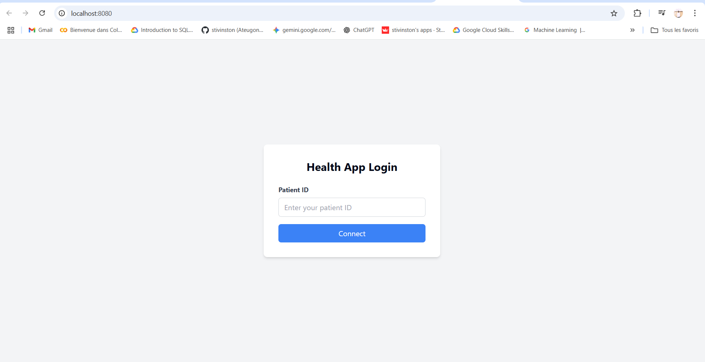
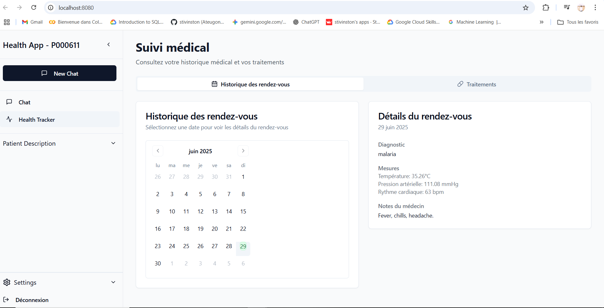
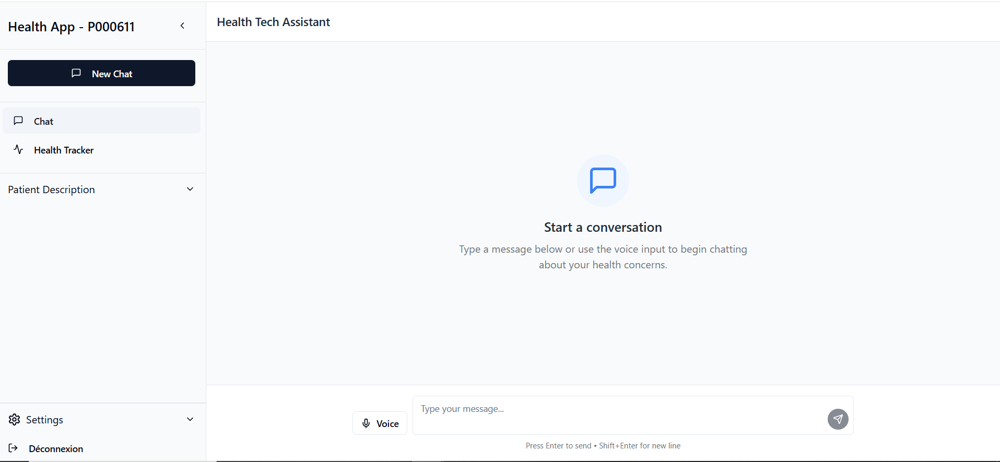

# 🩺 HealthTech Assistant – Patient-Centered LLM Chatbot

## Description
Ce dépôt contient le code source du HealthTech Assistant, un chatbot médical conversationnel développé dans le cadre du AI Innovation Hackathon organisé par l’Hôpital Général de Douala (DGH) en partenariat avec Data Science Without Borders (DSWB) et financé par le Wellcome Trust.

## Contexte du Hackathon
Ce projet est développé pour le Track 2 – Large Language Models for Enhanced Patient Education du Hackathon, qui vise à augmenter la compréhension de la santé des patients en rendant l’information médicale plus accessible, fiable et précise grâce à l’intelligence artificielle.

Notre solution exploite la puissance des Large Language Models (LLMs), notamment celui de Llama (Meta) pré-entrainé sur des données médicales, pour améliorer la compréhension du diagnostique du patient. 
L’objectif est de fournir aux patients des explications claires et adaptées à leur contexte culturel sur leur diagnostic, leurs médicaments et leur traitement.

## Fonctionnalités clés
✅ Interface utilisateur avec React.js

✅ Résumé médical généré automatiquement à partir des données patient

✅ Chatbot médical basé sur LangChain + modèle Hugging Face

✅ Support audio multilingue (français et anglais) : les réponses du chatbot peuvent être écoutées par le patient

✅ Mémoire conversationnelle persistante (SQLite)

✅ Personnalisation du style de réponse 

✅ Interface utilisateur médicale avec UI/UX adaptée

✅ Confidentialité respectée via session sécurisée et historisation locale

## Fonctionnalités en cours de développement
- Traduction vers les langues locales (bassa, douala, ewondo, etc.) pour renforcer l'inclusion linguistique
- Programmation de rappels intelligents et de questions de suivi (ex: "Comment vous sentez-vous après 3 jours de traitement ?")
- Version mobile offline pour zones à connectivité limitée

 ## 🛠️ Technologies utilisées

### Frontend
- React 18 avec TypeScript
- Tailwind CSS avec thème personnalisé
- Radix UI pour les composants accessibles
- React Router pour la navigation
- Axios pour les appels API

### Backend
- Python avec FastAPI
- LangChain pour l'intégration IA
- SQLite pour la persistance des données
- gTTS pour la synthèse vocale

## 🚀 Installation

### Prérequis

- Node.js 18+ et npm
- Python 3.9+

### Configuration du backend

1. Accédez au dossier backend :
   ```bash
   cd backend
   ```

2. Créez un environnement virtuel :
   ```bash
   python -m venv venv
   source venv/bin/activate  # Sur Windows : .\venv\Scripts\activate
   ```

3. Installez les dépendances :
   ```bash
   pip install -r requirements.txt
   ```

4. Lancez le serveur :
   ```bash
   python main.py
   ```

   ### Configuration du frontend

1. Accédez au dossier frontend :
   ```bash
   cd frontend
   ```

2. Installez les dépendances :
   ```bash
   npm install
   ```

3. Lancez l'application en mode développement :
   ```bash
   npm run dev
   ```

## 📁 Structure du projet

```
Health/
├── backend/               # Code source du backend
│   ├── main.py           # Point d'entrée de l'API
│   ├── requirements.txt  # Dépendances Python
│   └── static/           # Fichiers statiques (audio, etc.)
└── frontend/             # Code source du frontend
    ├── src/
    │   ├── components/   # Composants React
    │   ├── App.tsx       # Composant principal
    │   └── main.tsx      # Point d'entrée de l'application
    └── package.json      # Dépendances Node.js
```

## 📝 Utilisation

1. Lancez le serveur backend
2. Lancez l'application frontend
3. Connectez-vous avec un identifiant patient valide
4. Explorez les différentes fonctionnalités :
   - Chat avec l'IA médicale
   - Consultation du dossier patient
   - Suivi des symptômes
   - Paramètres d'affichage
  
## 📄 Licence

Ce projet est sous licence MIT. Voir le fichier `LICENSE` pour plus de détails.



